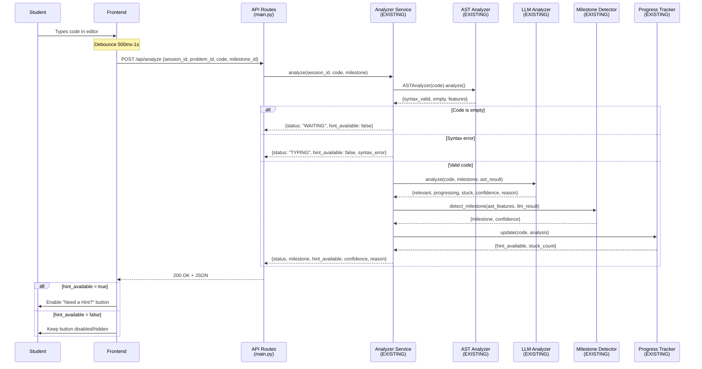
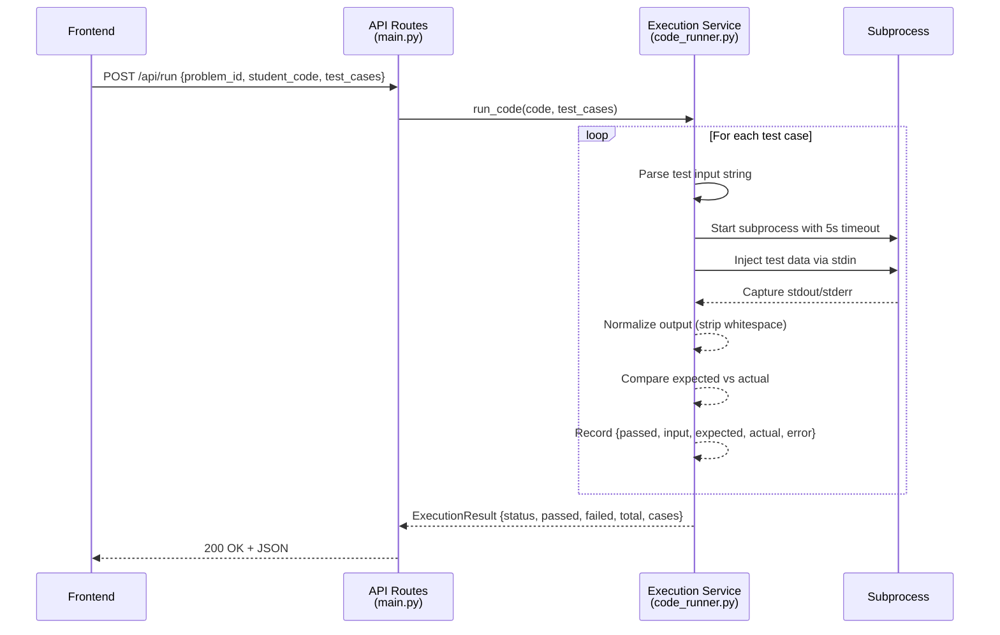
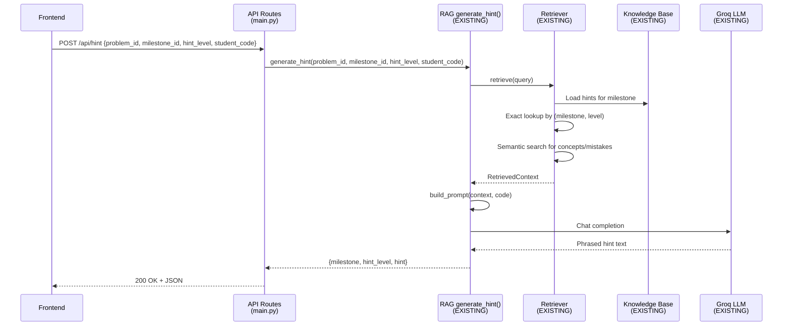

# ThinkForge AI Backend Integration - Technical Design (REVISED)

## Overview

ThinkForge AI is a coding tutor that uses progressive hints and adaptive learning to guide students through algorithm problems. This design document specifies the technical implementation for completing the backend integration layer.

### System Context

The system has three complete, working subsystems that **MUST NOT BE MODIFIED**:
1. **Analyzer Service** (backend/analyzer/) - Combines AST analysis with LLM-based progress detection
2. **RAG Service** (backend/rag/) - Retrieval-augmented generation for adaptive hints
3. **React Frontend** (thinkforge-tutor/src/) - Student-facing UI with code editor and test viewer

This integration adds:
- **Execution Service** - Runs student code in isolated subprocesses against test cases
- **API Route Layer** - REST endpoints that connect frontend to existing backend services
- **Test Case Data** - Official Two Sum test cases in JSON format

### Key Design Principles

1. **Frontend Contract is Source of Truth** - All API responses must exactly match frontend expectations
2. **Preserve Working Components** - Zero modifications to analyzer/ and rag/ directories
3. **Subprocess Isolation** - Student code executes in isolated processes (NOT exec/eval)
4. **Thin Integration Layer** - New services wrap existing components without replacing them
5. **Simple Prototype** - In-memory state, no database, no authentication, no WebSockets

### Scope

**In Scope:**
- Code execution sandbox (subprocess-based)
- Test case repository (backend/knowledge_base/two_sum/test_cases.json)
- API endpoints: /api/run, /api/submit, /api/hint
- Request/response schemas matching frontend exactly
- Error handling without exposing tracebacks

**Out of Scope:**
- Problem loading API (frontend has hardcoded problem)
- Database persistence
- User authentication
- WebSocket support
- Multiple programming languages (Python only)
- Production-grade sandboxing (Docker, seccomp)
- Modifying existing analyzer or RAG code

## Architecture

### CRITICAL: Frontend Contract Verification

The frontend (Micro-Project/thinkforge-tutor/src) defines the exact API contract. All backend responses MUST match these structures precisely.

**Frontend API Functions (api.js + Required Addition):**

| Function | HTTP Method | Endpoint | Request Body | Response | Component Using It |
|----------|-------------|----------|--------------|----------|-------------------|
| `analyzeCode()` | POST | `/api/analyze` | `{session_id, problem_id, student_code, milestone_id}` | `{status, milestone, hint_available, confidence, reason}` | SolveProblem.jsx (NEW - debounced on code change) |
| `generateHint()` | POST | `/api/hint` | `{problem_id, milestone_id, hint_level, student_code}` | `{milestone, hint_level, hint}` | SolveProblem.jsx (requestHint) |
| `runCode()` | POST | `/api/run` | `{problem_id, student_code, test_cases}` | `{status, passed, total, cases, runtime?, memory?}` | SolveProblem.jsx (handleRun, handleRunOne) |
| `submitSolution()` | POST | `/api/submit` | `{problem_id, student_code}` | `{status, passed, total, cases?, runtime?, memory?}` | SolveProblem.jsx (handleSubmit) |

**NOTE:** The frontend currently does NOT call `/api/analyze`. This endpoint must be added to the frontend to enable continuous code analysis and dynamic hint availability.

**Frontend Test Case Format (SAMPLE_CASES):**
```javascript
[
  { id: 1, input: 'nums = [2,7,11,15]\ntarget = 9', expected: '[0,1]' },
  { id: 2, input: 'nums = [3,2,4]\ntarget = 6', expected: '[1,2]' },
  { id: 3, input: 'nums = [3,3]\ntarget = 6', expected: '[0,1]' }
]
```

**Frontend Result Display (OutputPanel.jsx):**
- Expects `result.status` (string): "Accepted", "Wrong Answer", "Runtime Error"
- Expects `result.passed` (int) and `result.total` (int)
- Expects `result.runtime` (optional string) and `result.memory` (optional string)
- Expects `result.cases[]` array with `{passed: boolean}` for each test

### High-Level Component Diagram

```mermaid
graph TB
    subgraph "React Frontend (thinkforge-tutor/)"
        UI[SolveProblem Component]
        API[api.js Functions]
    end
    
    subgraph "FastAPI Backend"
        ROUTES[API Routes<br/>main.py]
        
        subgraph "New Services"
            ES[Execution Service<br/>execution/code_runner.py]
        end
        
        subgraph "Existing Services - NO CHANGES"
            AS[Analyzer Service<br/>analyzer/analyzer_service.py]
            RAG[RAG Service<br/>rag/generate_hint.py]
        end
        
        subgraph "Data"
            KB[Knowledge Base<br/>JSON Files]
            TC[Test Cases<br/>test_cases.json]
        end
    end
    
    UI -->|analyzeCode (NEW)| API
    UI -->|generateHint| API
    UI -->|runCode| API
    UI -->|submitSolution| API
    
    API -->|POST /api/analyze| ROUTES
    API -->|POST /api/hint| ROUTES
    API -->|POST /api/run| ROUTES
    API -->|POST /api/submit| ROUTES
    
    ROUTES -->|analyze| AS
    ROUTES -->|run_code| ES
    ROUTES -->|generate_hint| RAG
    
    AS --> KB
    ES --> TC
    RAG --> KB
```

### Data Flow: Continuous Code Analysis (NEW - CRITICAL)



### Data Flow: Code Execution



### Data Flow: Hint Generation (Existing RAG)



### Existing Service Integration Points

**AnalyzerService (backend/analyzer/analyzer_service.py):**
```python
class AnalyzerService:
    def analyze(self, session_id: str, code: str, milestone: str) -> dict:
        # Returns: {status, hint_available, milestone, llm, ast, tracking}
        pass
    
    def reset(self, session_id: str):
        pass
```

**Current /analyze endpoint exists but frontend doesn't use it**
- Frontend manages milestone state client-side
- Frontend uses 60-second inactivity timer for "stuck" prompt
- Backend analyzer is available but not actively called by current frontend
- Keep /analyze endpoint for potential future use

**RAG generate_hint() (backend/rag/generate_hint.py):**
```python
def generate_hint(
    problem_id: str,
    milestone_id: str,
    hint_level: int,
    student_code: str = "",
) -> dict:
    # Returns: {milestone, hint_level, hint}
    pass
```

**Integration Strategy:**
- **NO modifications to analyzer/ or rag/ code**
- API routes call existing functions directly
- No adapter layer needed - signatures already match requirements

## Components and Interfaces

### Execution Service

**Purpose:** Execute student code in isolated subprocesses with timeout enforcement and output capture.

**Location:** `backend/execution/code_runner.py` (MODIFY existing stub)

**IMPORTANT:** This is **PROTOTYPE-LEVEL ISOLATION ONLY**. Subprocess isolation prevents basic issues (infinite loops, excessive output) but is NOT secure against malicious code. Production systems require Docker containers, seccomp filters, resource limits, and network isolation.

**Class: CodeRunner**

```python
class CodeRunner:
    """
    Executes Python code in isolated subprocesses.
    
    WARNING: This provides basic isolation only (timeout, process separation).
    NOT suitable for production without additional sandboxing (Docker, seccomp, etc.).
    """
    
    def __init__(self, timeout_seconds: float = 5.0):
        """Initialize with default execution timeout."""
        self._timeout = timeout_seconds
    
    def run(
        self, 
        code: str, 
        test_cases: list[dict]
    ) -> dict:
        """
        Execute code against test cases.
        
        Args:
            code: Python source code (string)
            test_cases: List of dicts with {id, input, expected}
        
        Returns:
            {
                "status": "Accepted" | "Wrong Answer" | "Runtime Error" | "Time Limit Exceeded",
                "passed": int,
                "failed": int,
                "total": int,
                "cases": [
                    {
                        "passed": bool,
                        "input": str,
                        "expected": str,
                        "actual": str,
                        "error": str | null
                    }
                ],
                "runtime": str (optional),
                "memory": str (optional)
            }
        """
        
    def _run_single_test(
        self, 
        code: str, 
        test_case: dict
    ) -> dict:
        """Execute code for one test case in isolated subprocess."""
        
    def _parse_test_input(self, input_str: str) -> dict:
        """
        Parse frontend test input format:
        'nums = [2,7,11,15]\\ntarget = 9'
        
        Returns: {"nums": [2,7,11,15], "target": 9}
        """
        
    def _normalize_output(self, output: str) -> str:
        """Strip leading/trailing whitespace for comparison."""
```

**Subprocess Execution Strategy:**
```python
import subprocess
import tempfile
import time
from pathlib import Path

def _run_single_test(self, code: str, test_case: dict) -> dict:
    # Parse test input
    test_data = self._parse_test_input(test_case["input"])
    
    # Create wrapper code that calls student function
    wrapper = f'''
{code}

# Inject test data
nums = {test_data["nums"]}
target = {test_data["target"]}

# Call student solution
sol = Solution()
result = sol.twoSum(nums, target)
print(result)
'''
    
    # Write to temporary file
    with tempfile.NamedTemporaryFile(mode='w', suffix='.py', delete=False) as f:
        f.write(wrapper)
        temp_path = f.name
    
    try:
        start_time = time.time()
        
        # Run subprocess with timeout
        result = subprocess.run(
            ['python', temp_path],
            capture_output=True,
            text=True,
            timeout=self._timeout,
            shell=False  # Prevents shell injection
        )
        
        execution_time_ms = (time.time() - start_time) * 1000
        
        # Normalize outputs
        actual = self._normalize_output(result.stdout)
        expected = self._normalize_output(test_case["expected"])
        
        return {
            "passed": actual == expected,
            "input": test_case["input"],
            "expected": expected,
            "actual": actual,
            "error": result.stderr if result.returncode != 0 else None
        }
        
    except subprocess.TimeoutExpired:
        return {
            "passed": False,
            "input": test_case["input"],
            "expected": test_case["expected"],
            "actual": "",
            "error": "Time Limit Exceeded"
        }
    except Exception as e:
        return {
            "passed": False,
            "input": test_case["input"],
            "expected": test_case["expected"],
            "actual": "",
            "error": str(e)
        }
    finally:
        # Cleanup temporary file
        Path(temp_path).unlink(missing_ok=True)
```

**Integration Points:**
- Called by `/api/run` and `/api/submit` endpoints
- No dependencies on analyzer or RAG
- Returns structured results for frontend display

### API Route Layer

**Location:** `backend/main.py` (MODIFY existing)

**New Routes:**

```python
from execution import CodeRunner
from rag import generate_hint as rag_generate_hint
from analyzer import AnalyzerService

# Initialize services
execution_service = CodeRunner(timeout_seconds=5.0)
analyzer_service = AnalyzerService()

@app.post("/api/analyze")
async def analyze_code_endpoint(request: AnalyzeCodeRequest) -> AnalyzeCodeResponse:
    """Continuously analyze student code for progress and hint availability."""
    try:
        # Call existing analyzer service
        result = analyzer_service.analyze(
            session_id=request.session_id,
            code=request.student_code,
            milestone=request.milestone_id
        )
        
        # Transform analyzer result to match frontend expectations
        return AnalyzeCodeResponse(
            status=result.get("status", "WAITING"),
            milestone=result.get("milestone", request.milestone_id),
            hint_available=result.get("hint_available", False),
            confidence=result.get("llm", {}).get("confidence", 0.5),
            reason=result.get("llm", {}).get("reason", "")
        )
    except Exception as e:
        logger.exception(f"Error in /api/analyze: {e}")
        raise HTTPException(status_code=500, detail="Code analysis failed")

@app.post("/api/run")
async def run_code_endpoint(request: RunCodeRequest) -> RunCodeResponse:
    """Execute code against provided test cases."""
    try:
        result = execution_service.run(
            code=request.student_code,
            test_cases=request.test_cases
        )
        return RunCodeResponse(**result)
    except Exception as e:
        logger.exception(f"Error in /api/run: {e}")
        raise HTTPException(status_code=500, detail="Code execution failed")

@app.post("/api/submit")
async def submit_solution_endpoint(request: SubmitRequest) -> SubmitResponse:
    """Execute code against all official test cases."""
    try:
        # Load official test cases (including hidden)
        test_cases = _load_test_cases("two_sum", include_hidden=True)
        
        result = execution_service.run(
            code=request.student_code,
            test_cases=test_cases
        )
        
        # Format as submit response (no case details for hidden tests)
        return SubmitResponse(
            status=result["status"],
            passed=result["passed"],
            total=result["total"],
            runtime=result.get("runtime"),
            memory=result.get("memory")
        )
    except Exception as e:
        logger.exception(f"Error in /api/submit: {e}")
        raise HTTPException(status_code=500, detail="Submission failed")

@app.post("/api/hint")
async def generate_hint_endpoint(request: HintRequest) -> HintResponse:
    """Generate adaptive hint using existing RAG system."""
    try:
        result = rag_generate_hint(
            problem_id=request.problem_id,
            milestone_id=request.milestone_id,
            hint_level=request.hint_level,
            student_code=request.student_code
        )
        return HintResponse(**result)
    except Exception as e:
        logger.exception(f"Error in /api/hint: {e}")
        raise HTTPException(status_code=500, detail="Hint generation failed")
```

**Existing Routes (KEEP BUT UPDATE /analyze):**
```python
@app.post("/analyze")  # Keep legacy endpoint for compatibility
def analyze(request: AnalyzeRequest):
    """Legacy analyze endpoint - kept for backward compatibility."""
    return analyzer_service.analyze(
        session_id=request.session_id,
        code=request.code,
        milestone=request.milestone,
    )

@app.post("/reset/{session_id}")  # Keep for session management
def reset(session_id: str):
    analyzer_service.reset(session_id)
    return {"success": True}
```

**CORS Configuration (already correct):**
```python
app.add_middleware(
    CORSMiddleware,
    allow_origins=["http://localhost:5173"],
    allow_credentials=True,
    allow_methods=["*"],
    allow_headers=["*"],
)
```

### Test Case Management

**Location:** `backend/knowledge_base/two_sum/test_cases.json` (CREATE)

**Format:**
```json
[
  {
    "id": 1,
    "input": "nums = [2,7,11,15]\\ntarget = 9",
    "expected": "[0,1]",
    "is_sample": true
  },
  {
    "id": 2,
    "input": "nums = [3,2,4]\\ntarget = 6",
    "expected": "[1,2]",
    "is_sample": true
  },
  {
    "id": 3,
    "input": "nums = [3,3]\\ntarget = 6",
    "expected": "[0,1]",
    "is_sample": false
  },
  {
    "id": 4,
    "input": "nums = [0,4,3,0]\\ntarget = 0",
    "expected": "[0,3]",
    "is_sample": false
  },
  {
    "id": 5,
    "input": "nums = [-1,-2,-3,-4,-5]\\ntarget = -8",
    "expected": "[2,4]",
    "is_sample": false
  }
]
```

**Test Case Loading:**
```python
import json
from pathlib import Path

def _load_test_cases(problem_id: str, include_hidden: bool = False) -> list[dict]:
    """Load test cases from knowledge base."""
    path = Path(__file__).parent / "knowledge_base" / problem_id / "test_cases.json"
    with open(path) as f:
        all_cases = json.load(f)
    
    if include_hidden:
        return all_cases
    else:
        return [c for c in all_cases if c.get("is_sample", False)]
```

### Session Management

**Current State:** Already implemented in `AnalyzerService.trackers`

```python
# backend/analyzer/analyzer_service.py (EXISTING - NO CHANGES)
class AnalyzerService:
    def __init__(self):
        self.trackers = {}  # session_id -> ProgressTracker
```

**No additional session management needed** - Frontend manages:
- Current milestone (client-side state)
- Hint level (client-side state)
- Inactivity timer (client-side 60s timeout)

Backend analyzer's session state is available but not actively used by current frontend.

## Data Models

### API Request/Response Models (MUST match frontend exactly)

**Location:** `backend/models/schemas.py` (MODIFY existing)

```python
from pydantic import BaseModel
from typing import Optional

# ============================================
# EXISTING MODELS (KEEP UNCHANGED)
# ============================================

class AnalyzeRequest(BaseModel):
    session_id: str
    code: str
    milestone: str = "brute_force"

class HintRequest(BaseModel):
    session_id: str
    problem_id: str
    milestone_id: str
    hint_level: int
    student_code: str = ""

# ============================================
# NEW MODELS FOR CONTINUOUS CODE ANALYSIS
# ============================================

class AnalyzeCodeRequest(BaseModel):
    """Frontend POST /api/analyze request for continuous code analysis."""
    session_id: str
    problem_id: str
    student_code: str
    milestone_id: str = "brute_force"

class AnalyzeCodeResponse(BaseModel):
    """Frontend expects this structure from POST /api/analyze."""
    status: str  # "WAITING", "TYPING", "RELEVANT", "PROGRESSING", "STUCK"
    milestone: str
    hint_available: bool
    confidence: float
    reason: str

# ============================================
# NEW MODELS FOR CODE EXECUTION
# ============================================

class RunCodeRequest(BaseModel):
    """Frontend POST /api/run request."""
    problem_id: str
    student_code: str
    test_cases: list[dict]  # [{id, input, expected}, ...]

class RunCodeResponse(BaseModel):
    """Frontend expects this structure from POST /api/run."""
    status: str  # "Accepted", "Wrong Answer", "Runtime Error", "Time Limit Exceeded"
    passed: int
    total: int
    cases: list[dict]  # [{passed: bool, ...}, ...]
    runtime: Optional[str] = None  # e.g., "45 ms"
    memory: Optional[str] = None   # e.g., "14.2 MB"

class SubmitRequest(BaseModel):
    """Frontend POST /api/submit request."""
    problem_id: str
    student_code: str

class SubmitResponse(BaseModel):
    """Frontend expects this structure from POST /api/submit."""
    status: str  # "Accepted", "Wrong Answer", "Runtime Error"
    passed: int
    total: int
    cases: Optional[list[dict]] = None  # Optional: hide details for hidden tests
    runtime: Optional[str] = None
    memory: Optional[str] = None

class HintResponse(BaseModel):
    """Frontend expects this structure from POST /api/hint."""
    milestone: str
    hint_level: int
    hint: str
```

### Frontend Test Case Format

The frontend (TestCases.jsx) provides test cases in this format:

```javascript
[
  { id: 1, input: 'nums = [2,7,11,15]\\ntarget = 9', expected: '[0,1]' },
  { id: 2, input: 'nums = [3,2,4]\\ntarget = 6', expected: '[1,2]' },
  { id: 3, input: 'nums = [3,3]\\ntarget = 6', expected: '[0,1]' }
]
```

**Backend must parse the `input` string:**
- Split by newline
- Parse each line as Python assignment
- Extract variable name and value
- Example: `'nums = [2,7,11,15]\\ntarget = 9'` → `{"nums": [2,7,11,15], "target": 9}`

### Test Case File Format

**Location:** `backend/knowledge_base/two_sum/test_cases.json` (CREATE)

```json
[
  {
    "id": 1,
    "input": "nums = [2,7,11,15]\\ntarget = 9",
    "expected": "[0,1]",
    "is_sample": true
  },
  {
    "id": 2,
    "input": "nums = [3,2,4]\\ntarget = 6",
    "expected": "[1,2]",
    "is_sample": true
  },
  {
    "id": 3,
    "input": "nums = [3,3]\\ntarget = 6",
    "expected": "[0,1]",
    "is_sample": false
  }
]
```

### Status Determination Logic

```python
def determine_status(cases: list[dict]) -> str:
    """
    Determine overall status from test case results.
    
    Priority:
    1. Time Limit Exceeded - if any case timed out
    2. Runtime Error - if any case has non-timeout error
    3. Wrong Answer - if any case failed comparison
    4. Accepted - all cases passed
    """
    has_timeout = any(
        c.get("error") == "Time Limit Exceeded" 
        for c in cases
    )
    if has_timeout:
        return "Time Limit Exceeded"
    
    has_error = any(
        c.get("error") is not None and c.get("error") != "Time Limit Exceeded"
        for c in cases
    )
    if has_error:
        return "Runtime Error"
    
    all_passed = all(c.get("passed", False) for c in cases)
    if all_passed:
        return "Accepted"
    else:
        return "Wrong Answer"
```

## Error Handling

### HTTP Status Code Strategy

```python
# Success
200 OK - Successful request (includes "Wrong Answer" execution results)

# Client Errors
400 Bad Request - Invalid request format or parameters
404 Not Found - Problem ID doesn't exist
422 Unprocessable Entity - Request fails Pydantic validation

# Server Errors
500 Internal Server Error - Unexpected server failure
503 Service Unavailable - LLM service timeout or unavailable
```

### Error Response Format

```python
class ErrorResponse(BaseModel):
    error: str
    detail: str
    status_code: int
```

### Error Logging

```python
import logging

logger = logging.getLogger("thinkforge")

# Log levels:
# - ERROR: Problem file load failures, subprocess crashes
# - WARNING: Validation errors, timeout exceeded
# - INFO: Successful API calls, cache hits
# - DEBUG: Subprocess output, detailed execution trace
```

### Exception Hierarchy

```python
class ThinkForgeError(Exception):
    """Base exception for all ThinkForge errors."""
    pass

class ProblemNotFoundError(ThinkForgeError):
    """Problem ID doesn't exist in knowledge base."""
    pass

class ValidationError(ThinkForgeError):
    """Problem metadata or test case validation failed."""
    pass

class ExecutionError(ThinkForgeError):
    """Code execution failed unexpectedly."""
    pass

class TimeoutError(ThinkForgeError):
    """Code execution exceeded timeout."""
    pass
```

### Error Handling Pattern

```python
@app.post("/api/run")
async def run_code(request: RunCodeRequest) -> RunCodeResponse:
    try:
        # Validate problem exists
        problem = problem_service.get_problem(request.problem_id)
        
        # Execute code
        result = execution_service.run_code(
            request.student_code,
            request.test_cases
        )
        
        return RunCodeResponse(**result.dict())
        
    except ProblemNotFoundError as e:
        logger.error(f"Problem not found: {request.problem_id}")
        raise HTTPException(status_code=404, detail=str(e))
        
    except ValidationError as e:
        logger.error(f"Validation failed: {e}")
        raise HTTPException(status_code=400, detail=str(e))
        
    except Exception as e:
        logger.exception(f"Unexpected error in /api/run: {e}")
        raise HTTPException(status_code=500, detail="Internal server error")
```

## Testing Strategy

### Unit Testing

**Test Framework:** pytest

**Test Organization:**
```
backend/tests/
  test_problem_service.py
  test_execution_service.py
  test_api_routes.py
  test_schemas.py
```

**Unit Test Focus:**
- Problem loading and validation
- Test case parsing
- Output normalization
- Single test case execution
- Error condition handling

### Property-Based Testing

**Library:** Hypothesis (Python property testing library)

**Test Configuration:**
- Minimum 100 iterations per property
- Tagged with feature name and property number
- Reference design document properties

### Integration Testing

**Test Fixture:**
```python
from fastapi.testclient import TestClient

@pytest.fixture
def client():
    """Create test client with all routes registered."""
    return TestClient(app)

@pytest.fixture
def mock_llm():
    """Mock Groq LLM responses for deterministic tests."""
    # Patch groq.Client to return fixed responses
```

**Integration Test Scenarios:**
- Full round-trip: problem load → code run → result display
- Hint generation with mocked LLM
- Submit flow with passing and failing solutions
- Error scenarios (404, 422, 500)

### Manual Testing

**Test Scenarios:**
1. Load frontend, verify problem displays
2. Run code with correct solution, verify "Accepted"
3. Run code with wrong solution, verify "Wrong Answer" with details
4. Request hint, verify hint displays in card
5. Submit correct solution, verify all test cases pass
6. Submit wrong solution, verify failure message

## Implementation Plan

### File Creation/Modification Summary

**Create New Files:**
```
backend/services/
  __init__.py
  problem_service.py
  execution_service.py

backend/knowledge_base/two_sum/
  test_cases.json

backend/tests/
  test_problem_service.py
  test_execution_service.py
  test_api_integration.py
```

**Modify Existing Files:**
```
backend/main.py
  - Add /api/problems, /api/problems/{id}, /api/run, /api/submit
  - Move /hint to /api/hint
  - Instantiate ProblemService and ExecutionService
  - Add error handlers

backend/models/schemas.py
  - Add ProblemSummary, ProblemDetail, ProblemExample
  - Add TestCase, TestCaseResult, ExecutionResult
  - Add RunCodeRequest, RunCodeResponse
  - Add SubmitRequest, SubmitResponse
  - Add HintResponse
```

**Preserve Unchanged:**
```
backend/analyzer/
  - All files unchanged

backend/rag/
  - All files unchanged

backend/knowledge_base/two_sum/
  - metadata.json, hints.json, concepts.json, mistakes.json, complexity.json
  - All unchanged
```

### Implementation Phases

**Phase 1: Problem Service**
1. Create `services/problem_service.py`
2. Implement problem loading and validation
3. Add Pydantic models for problems
4. Create test_cases.json for Two Sum
5. Unit test problem service

**Phase 2: Execution Service**
6. Implement `services/execution_service.py`
7. Implement subprocess execution with timeout
8. Implement output normalization
9. Unit test execution service

**Phase 3: API Routes**
10. Add /api/problems and /api/problems/{id}
11. Add /api/run endpoint
12. Add /api/submit endpoint
13. Move /hint to /api/hint
14. Add error handlers

**Phase 4: Integration Testing**
15. Write integration tests
16. Test with frontend
17. Fix API contract mismatches
18. Verify end-to-end flows

### Dependencies

**Required Python Packages:**
```
fastapi
pydantic
uvicorn
python-dotenv
groq
# All already in pyproject.toml
```

**No New Dependencies Required**

## Correctness Properties

*A property is a characteristic or behavior that should hold true across all valid executions of a system—essentially, a formal statement about what the system should do. Properties serve as the bridge between human-readable specifications and machine-verifiable correctness guarantees.*


### Property Reflection

Before defining correctness properties, I reviewed all testable criteria from the prework analysis to eliminate redundancy:

**Redundancies Identified:**

1. **Output Normalization Cluster** (12.2, 12.4, 12.5):
   - Property 12.2 tests that whitespace is stripped
   - Property 12.4 tests that whitespace-only differences pass
   - Property 12.5 tests that content differences fail
   - **Resolution:** Combine into single comprehensive property about normalization behavior

2. **Test Case Result Structure** (6.6, 7.4):
   - Property 6.6 tests TestCaseResult contains specific fields
   - Property 7.4 tests ExecutionResult contains specific fields
   - **Resolution:** Keep separate as they validate different data structures

3. **Status Code Mapping** (7.5, 7.6, 7.7, 7.8):
   - Each tests the relationship between status string and execution results
   - **Resolution:** Combine into single property about status determination logic

4. **Schema Validation** (1.3, 4.3, 4.4):
   - All test that parsed objects contain required fields
   - **Resolution:** Combine into single property about schema validation

5. **Test Case Loading** (8.3, 8.4):
   - 8.3 tests loading all test cases
   - 8.4 tests executing against all test cases
   - **Resolution:** 8.4 implies 8.3, keep only 8.4

6. **Message Content** (8.6, 8.7):
   - Both test the message field based on accepted status
   - **Resolution:** Combine into single property about message generation

After reflection, I've reduced the property set from 45+ testable criteria to 28 unique, non-redundant properties.

### Property 1: Problem Metadata Loading

*For any* valid problem directory with complete metadata.json, loading the problem should succeed and return a ProblemDetail object with all required fields populated.

**Validates: Requirements 1.1, 1.3**

### Property 2: Malformed Metadata Error Reporting

*For any* malformed JSON file, the Problem_Service should raise an error containing both the file path and a description of the parsing issue.

**Validates: Requirements 1.2**

### Property 3: Missing Field Validation

*For any* problem metadata JSON missing required fields, the Problem_Service should raise a ValidationError that specifically identifies which fields are missing.

**Validates: Requirements 1.4**

### Property 4: Problem Cache Consistency

*For any* problem_id, calling get_problem twice should return equivalent results and should not read the file twice (cache hit on second call).

**Validates: Requirements 1.5**

### Property 5: Problem List Structure

*For any* problem list returned from GET /api/problems, each problem entry should contain exactly the fields: id, title, and difficulty.

**Validates: Requirements 2.2, 2.3**

### Property 6: Problem Detail Completeness

*For any* valid problem_id, GET /api/problems/{problem_id} should return a response containing all fields: id, title, difficulty, description, input_format, output_format, constraints, examples, and starter_code.

**Validates: Requirements 3.2, 3.3**

### Property 7: Test Case Sample/Hidden Filtering

*For any* problem with both sample and hidden test cases, calling get_test_cases with include_hidden=False should return only cases where is_sample=True, and include_hidden=True should return all cases.

**Validates: Requirements 4.2**

### Property 8: Test Case Schema Validation

*For any* test case data structure, it should contain all required fields: case_id, input, expected_output, is_sample, and optional fields description and timeout_ms.

**Validates: Requirements 4.3, 4.4**

### Property 9: Test Case Validation Errors

*For any* test case data missing required fields or with invalid types, the Backend should raise a ValidationError describing the specific validation failure.

**Validates: Requirements 4.5**

### Property 10: Execution Timeout Enforcement

*For any* code that runs an infinite loop or exceeds the configured timeout, the Execution_Service should terminate the subprocess and return a result with status "Time Limit Exceeded".

**Validates: Requirements 5.2, 5.3**

### Property 11: Subprocess Output Capture

*For any* executed student code, the Execution_Service should capture and return stdout (actual output), stderr (error messages), and the return code in the result object.

**Validates: Requirements 5.4**

### Property 12: Non-Zero Exit Classification

*For any* subprocess that terminates with a non-zero return code, the ExecutionResult status should be "Runtime Error".

**Validates: Requirements 5.6**

### Property 13: Test Input Injection

*For any* test case with input data, the student code execution should have access to that input data (injected into the execution environment).

**Validates: Requirements 6.1**

### Property 14: Output Capture Completeness

*For any* student code execution, the actual output produced should be captured and included in the TestCaseResult.

**Validates: Requirements 6.2**

### Property 15: Output Normalization Equivalence

*For any* two output strings that differ only in leading/trailing whitespace, normalizing both should produce identical strings, and the test case comparison should mark them as passed.

**Validates: Requirements 6.3, 6.4, 12.2, 12.4**

### Property 16: Normalized Output Difference Detection

*For any* two output strings that differ in content (not just whitespace), after normalization they should still be different, the test case should be marked as failed, and both normalized outputs should be included in the result.

**Validates: Requirements 12.5**

### Property 17: Execution Time Recording

*For any* test case execution, the result should include execution_time_ms field with a non-negative float value representing milliseconds.

**Validates: Requirements 6.5**

### Property 18: Test Case Result Structure

*For any* executed test case, the TestCaseResult should contain: case_id, passed (boolean), input, expected, actual, error (optional), and execution_time_ms.

**Validates: Requirements 6.6**

### Property 19: Multiple Test Case Execution

*For any* list of test cases provided to run_code, the Execution_Service should execute the code against every test case in the list and return a result for each.

**Validates: Requirements 7.3**

### Property 20: Execution Result Structure

*For any* code execution against multiple test cases, the ExecutionResult should contain: status, passed (int), failed (int), total (int), cases (list), and execution_time_ms.

**Validates: Requirements 7.4**

### Property 21: Status Determination Logic

*For any* ExecutionResult:
- IF all test cases passed, THEN status should be "Accepted"
- IF at least one test case has wrong output, THEN status should be "Wrong Answer"
- IF at least one test case has a runtime error, THEN status should be "Runtime Error"
- IF at least one test case timed out, THEN status should be "Time Limit Exceeded"

**Validates: Requirements 7.5, 7.6, 7.7, 7.8**

### Property 22: Student Error HTTP Status

*For any* code execution that fails due to student code errors (wrong answer, runtime error, timeout), the API should return HTTP 200 with the error details in the response body, not an HTTP error status.

**Validates: Requirements 7.9, 8.8**

### Property 23: Submit Loads All Test Cases

*For any* POST /api/submit request, the Backend should execute the student code against all official test cases for that problem, including both sample and hidden cases.

**Validates: Requirements 8.3, 8.4**

### Property 24: Submit Response Structure

*For any* submit request, the SubmitResponse should contain: accepted (boolean), passed (int), failed (int), total (int), execution_time_ms, and message.

**Validates: Requirements 8.5**

### Property 25: Submit Message Generation

*For any* SubmitResponse:
- IF accepted is true, THEN message should be "All test cases passed!"
- IF accepted is false, THEN message should indicate which test case failed

**Validates: Requirements 8.6, 8.7**

### Property 26: Hint Response Structure

*For any* successful hint generation request, the response should contain: milestone (string), hint_level (int), and hint (string).

**Validates: Requirements 9.4**

### Property 27: Schema Validation Rejection

*For any* API request that does not conform to the expected Pydantic schema, the Backend should return HTTP 422 with validation error details.

**Validates: Requirements 10.7**

### Property 28: Error Status Code Categories

*For any* error response:
- Client errors (bad request, not found, validation) should return HTTP 4xx
- Server errors (unexpected failures) should return HTTP 5xx

**Validates: Requirements 11.5**

### Property 29: Test Case JSON Serialization Round-Trip

*For any* valid TestCase object, serializing it to JSON then parsing it back should produce an equivalent TestCase object (round-trip property).

**Validates: Requirements 14.1, 14.2, 14.3, 14.4**

### Property 30: Malformed JSON Error Reporting

*For any* malformed JSON test case file, parsing should raise an error that includes information about the location of the parsing failure.

**Validates: Requirements 14.5**

### Property 31: JSON Test Case Serializability

*For any* test case, its input and expected_output fields should be JSON-serializable structures.

**Validates: Requirements 13.6**

## Testing Strategy

### Dual Testing Approach

This project requires both **unit tests** and **property-based tests** for comprehensive coverage:

- **Unit Tests**: Verify specific examples, edge cases, API contracts, and integration points
- **Property Tests**: Verify universal properties hold across all inputs through randomized testing

Both approaches are complementary and necessary:
- Unit tests catch concrete bugs in specific scenarios
- Property tests verify general correctness across the input space
- Together they provide comprehensive confidence in system behavior

### Unit Testing

**Framework:** pytest

**Test Organization:**
```
backend/tests/
├── unit/
│   ├── test_problem_service.py
│   ├── test_execution_service.py
│   └── test_schemas.py
├── integration/
│   ├── test_api_problems.py
│   ├── test_api_run.py
│   ├── test_api_submit.py
│   └── test_api_hint.py
└── conftest.py
```

**Unit Test Coverage:**
- Problem loading with valid metadata (Requirements 2.1, 3.1)
- Problem not found returns 404 (Requirement 3.4)
- Empty knowledge base returns 500 (Requirement 2.5)
- Specific Two Sum test cases exist (Requirements 13.1, 13.2, 13.3, 13.4, 13.5)
- /api/hint endpoint exists (Requirement 9.1)
- /analyze endpoint still works (Requirement 9.2)
- /hint without /api prefix returns 404 (Requirement 9.5)
- Valid requests return 200 (Requirements 2.4, 3.5)
- Endpoint request schemas (Requirements 7.2, 8.2, 9.3)

**Edge Case Coverage:**
- Empty knowledge base directory
- Problem ID doesn't exist (404)
- Malformed JSON files
- Test cases with whitespace-only differences

### Property-Based Testing

**Library:** Hypothesis (Python property-based testing library)

**Configuration:**
- Minimum 100 iterations per property test
- Deterministic seeds for reproducibility
- Each test tagged with feature name and property number

**Property Test Tag Format:**
```python
# Feature: thinkforge-backend-integration, Property 1: Problem Metadata Loading
@given(valid_problem_metadata())
def test_property_1_problem_metadata_loading(metadata):
    ...
```

**Hypothesis Strategies:**
```python
from hypothesis import given, strategies as st

# Generate valid problem metadata
@st.composite
def valid_problem_metadata(draw):
    return {
        "id": draw(st.text(min_size=1)),
        "title": draw(st.text(min_size=1)),
        "difficulty": draw(st.sampled_from(["Easy", "Medium", "Hard"])),
        "description": draw(st.text()),
        "input_format": draw(st.text()),
        "output_format": draw(st.text()),
        "constraints": draw(st.lists(st.text(), min_size=1)),
        "examples": draw(st.lists(example_strategy(), min_size=1)),
        "starter_code": draw(st.text()),
        "milestones": draw(st.lists(st.text(), min_size=1))
    }

# Generate test cases
@st.composite
def test_case_strategy(draw):
    return {
        "case_id": draw(st.text(min_size=1)),
        "input": draw(st.dictionaries(st.text(), st.integers())),
        "expected_output": draw(st.text()),
        "is_sample": draw(st.booleans()),
        "description": draw(st.text())
    }

# Generate code that times out
@st.composite
def timeout_code(draw):
    return "while True: pass"

# Generate whitespace variations
@st.composite
def whitespace_variants(draw, base_string):
    prefix = draw(st.text(alphabet=' \t\n', max_size=5))
    suffix = draw(st.text(alphabet=' \t\n', max_size=5))
    return prefix + base_string + suffix
```

**Property Tests to Implement:**
- Property 1: Problem Metadata Loading (100 iterations with valid metadata)
- Property 4: Problem Cache Consistency (100 iterations with random problem IDs)
- Property 10: Execution Timeout Enforcement (100 iterations with infinite loops)
- Property 15: Output Normalization Equivalence (100 iterations with whitespace variants)
- Property 21: Status Determination Logic (100 iterations with various test results)
- Property 29: Test Case JSON Serialization Round-Trip (100 iterations with random TestCase objects)

Each property test references its design document property in a comment:
```python
# Feature: thinkforge-backend-integration, Property 29: Test Case JSON Serialization Round-Trip
@given(test_case_strategy())
def test_property_29_testcase_round_trip(test_case):
    """Verify that TestCase serialization -> deserialization preserves data."""
    # Serialize
    json_str = json.dumps(test_case)
    # Deserialize
    parsed = json.loads(json_str)
    # Verify equivalence
    assert parsed == test_case
```

### Integration Testing

**Test Fixture:**
```python
import pytest
from fastapi.testclient import TestClient
from backend.main import app

@pytest.fixture
def client():
    """Create test client with all routes registered."""
    return TestClient(app)

@pytest.fixture
def mock_llm(monkeypatch):
    """Mock Groq LLM to avoid external API calls during tests."""
    def mock_generate(self, *args, **kwargs):
        return MockResponse("This is a test hint.")
    
    monkeypatch.setattr("groq.Client.chat.completions.create", mock_generate)
```

**Integration Test Scenarios:**
1. Full flow: Load problem → Run code → Verify results
2. Submit passing solution → Verify accepted=True
3. Submit failing solution → Verify accepted=False with message
4. Request hint → Verify hint structure
5. Run code with timeout → Verify timeout status
6. Request non-existent problem → Verify 404
7. Send invalid request → Verify 422

### Manual Testing Checklist

**Frontend Integration:**
1. ✓ Navigate to http://localhost:5173
2. ✓ Verify Two Sum problem displays correctly
3. ✓ Write correct solution and click Run
4. ✓ Verify "Accepted" status displays
5. ✓ Write incorrect solution and click Run
6. ✓ Verify "Wrong Answer" with diff
7. ✓ Click "Get Hint" button
8. ✓ Verify hint card displays
9. ✓ Submit correct solution
10. ✓ Verify "All test cases passed!" message
11. ✓ Submit incorrect solution
12. ✓ Verify failure message with test case number

**API Testing:**
```bash
# Test problem list
curl http://localhost:8000/api/problems

# Test problem detail
curl http://localhost:8000/api/problems/two_sum

# Test run code
curl -X POST http://localhost:8000/api/run \
  -H "Content-Type: application/json" \
  -d '{
    "problem_id": "two_sum",
    "student_code": "def two_sum(nums, target): return [0, 1]",
    "test_cases": [{"input": {"nums": [2,7], "target": 9}, "expected_output": "[0, 1]"}]
  }'

# Test submit
curl -X POST http://localhost:8000/api/submit \
  -H "Content-Type: application/json" \
  -d '{
    "problem_id": "two_sum",
    "student_code": "def two_sum(nums, target): return [0, 1]"
  }'

# Test hint
curl -X POST http://localhost:8000/api/hint \
  -H "Content-Type: application/json" \
  -d '{
    "session_id": "test123",
    "problem_id": "two_sum",
    "milestone_id": "brute_force",
    "hint_level": 1,
    "student_code": ""
  }'
```

## Appendix: Detailed API Specifications

### GET /api/problems

**Description:** List all available problems

**Request:** None

**Response:** 200 OK
```json
[
  {
    "id": "two_sum",
    "title": "Two Sum",
    "difficulty": "Easy"
  }
]
```

**Error Responses:**
- 500 Internal Server Error: Knowledge base inaccessible

---

### GET /api/problems/{problem_id}

**Description:** Get full problem details

**Path Parameters:**
- `problem_id` (string): Problem identifier

**Response:** 200 OK
```json
{
  "id": "two_sum",
  "title": "Two Sum",
  "difficulty": "Easy",
  "description": "Given an array of integers nums and an integer target...",
  "input_format": "nums: List[int], target: int",
  "output_format": "List[int] - indices of two numbers",
  "constraints": [
    "2 <= nums.length <= 10^4",
    "-10^9 <= nums[i] <= 10^9"
  ],
  "examples": [
    {
      "input": "nums = [2,7,11,15], target = 9",
      "output": "[0,1]"
    }
  ],
  "starter_code": "def two_sum(nums, target):\n    pass",
  "milestones": [
    "brute_force",
    "recognize_inefficiency",
    "discover_complement",
    "introduce_hash_map",
    "apply_hash_map_correctly"
  ]
}
```

**Error Responses:**
- 404 Not Found: Problem doesn't exist
```json
{
  "error": "Problem not found",
  "detail": "Problem 'invalid_id' does not exist",
  "status_code": 404
}
```

---

### POST /api/run

**Description:** Run code against sample test cases

**Request Body:**
```json
{
  "problem_id": "two_sum",
  "student_code": "def two_sum(nums, target):\n    return [0, 1]",
  "test_cases": [
    {
      "case_id": "sample_1",
      "input": {"nums": [2, 7, 11, 15], "target": 9},
      "expected_output": "[0, 1]",
      "is_sample": true
    }
  ]
}
```

**Response:** 200 OK
```json
{
  "status": "Accepted",
  "passed": 1,
  "failed": 0,
  "total": 1,
  "cases": [
    {
      "case_id": "sample_1",
      "passed": true,
      "input": {"nums": [2, 7, 11, 15], "target": 9},
      "expected": "[0, 1]",
      "actual": "[0, 1]",
      "error": null,
      "execution_time_ms": 12.5
    }
  ],
  "execution_time_ms": 12.5
}
```

**Status Values:**
- "Accepted": All test cases passed
- "Wrong Answer": At least one test case failed
- "Runtime Error": Code crashed or raised exception
- "Time Limit Exceeded": Code exceeded timeout

**Error Responses:**
- 404 Not Found: Problem doesn't exist
- 422 Unprocessable Entity: Invalid request schema
- 500 Internal Server Error: Unexpected execution failure

---

### POST /api/submit

**Description:** Submit solution for grading against all test cases

**Request Body:**
```json
{
  "problem_id": "two_sum",
  "student_code": "def two_sum(nums, target):\n    seen = {}\n    for i, num in enumerate(nums):\n        complement = target - num\n        if complement in seen:\n            return [seen[complement], i]\n        seen[num] = i"
}
```

**Response:** 200 OK
```json
{
  "accepted": true,
  "passed": 3,
  "failed": 0,
  "total": 3,
  "execution_time_ms": 45.2,
  "message": "All test cases passed!"
}
```

**Failed Submission Response:**
```json
{
  "accepted": false,
  "passed": 2,
  "failed": 1,
  "total": 3,
  "execution_time_ms": 38.7,
  "message": "Failed on test case 3"
}
```

**Error Responses:**
- 404 Not Found: Problem doesn't exist
- 422 Unprocessable Entity: Invalid request schema

---

### POST /api/hint

**Description:** Generate adaptive hint based on student progress

**Request Body:**
```json
{
  "session_id": "user123",
  "problem_id": "two_sum",
  "milestone_id": "brute_force",
  "hint_level": 1,
  "student_code": "def two_sum(nums, target):\n    for i in range(len(nums)):\n        pass"
}
```

**Response:** 200 OK
```json
{
  "milestone": "brute_force",
  "hint_level": 1,
  "hint": "Try comparing each element with every other element using nested loops."
}
```

**Error Responses:**
- 404 Not Found: Problem or milestone doesn't exist
- 422 Unprocessable Entity: Invalid request schema
- 503 Service Unavailable: LLM service timeout

---

## Implementation Roadmap

### Phase 1: Foundation (Day 1)

**Files to Create:**
- `backend/services/__init__.py`
- `backend/services/problem_service.py`
- `backend/knowledge_base/two_sum/test_cases.json`

**Files to Modify:**
- `backend/models/schemas.py` (add ProblemSummary, ProblemDetail, TestCase models)

**Tasks:**
1. Create ProblemService class with load, validate, cache logic
2. Create test_cases.json with 3 test cases for Two Sum
3. Add Pydantic models for problem domain
4. Write unit tests for ProblemService
5. Verify problem loading works

**Verification:**
```python
from backend.services.problem_service import ProblemService
service = ProblemService()
problems = service.list_problems()
assert len(problems) > 0
problem = service.get_problem("two_sum")
assert problem.title == "Two Sum"
```

### Phase 2: Execution (Day 2)

**Files to Create:**
- `backend/services/execution_service.py`

**Files to Modify:**
- `backend/models/schemas.py` (add ExecutionResult, TestCaseResult models)

**Tasks:**
1. Implement ExecutionService with subprocess execution
2. Implement timeout enforcement
3. Implement output normalization
4. Add execution result models
5. Write unit tests for ExecutionService
6. Test with timeout code, correct code, incorrect code

**Verification:**
```python
from backend.services.execution_service import ExecutionService
service = ExecutionService()
code = "def two_sum(nums, target): return [0, 1]"
cases = [TestCase(...)]
result = service.run_code(code, cases)
assert result.status == "Accepted"
```

### Phase 3: API Routes (Day 3)

**Files to Modify:**
- `backend/main.py` (add all /api/* routes)
- `backend/models/schemas.py` (add request/response models)

**Tasks:**
1. Add GET /api/problems
2. Add GET /api/problems/{id}
3. Add POST /api/run
4. Add POST /api/submit
5. Move POST /hint to POST /api/hint
6. Add error handlers
7. Write integration tests

**Verification:**
```bash
# Start server
uvicorn backend.main:app --reload

# Test endpoints
curl http://localhost:8000/api/problems
curl http://localhost:8000/api/problems/two_sum
# ... test others
```

### Phase 4: Integration & Testing (Day 4)

**Files to Create:**
- `backend/tests/integration/test_api_problems.py`
- `backend/tests/integration/test_api_run.py`
- `backend/tests/integration/test_api_submit.py`
- `backend/tests/integration/test_api_hint.py`

**Tasks:**
1. Write integration tests for all endpoints
2. Test with frontend running
3. Fix any API contract mismatches
4. Verify end-to-end flows work
5. Test error scenarios
6. Performance check

**Verification:**
```bash
# Run all tests
pytest backend/tests/

# Start frontend
cd Micro-Project/thinkforge-tutor
npm run dev

# Manual testing in browser
```

### Phase 5: Property-Based Tests (Day 5)

**Files to Create:**
- `backend/tests/properties/test_problem_properties.py`
- `backend/tests/properties/test_execution_properties.py`
- `backend/tests/properties/test_serialization_properties.py`

**Tasks:**
1. Install Hypothesis
2. Create Hypothesis strategies
3. Implement property tests for key properties
4. Run with 100+ iterations
5. Fix any bugs found by property tests

**Verification:**
```bash
pytest backend/tests/properties/ -v
# All properties should pass 100+ test cases
```

---

## Success Criteria

The integration is complete when:

1. ✓ All 15 requirements from requirements.md are implemented
2. ✓ All API endpoints return correct response structures
3. ✓ Frontend can load problems, run code, submit solutions, and get hints
4. ✓ All unit tests pass
5. ✓ All integration tests pass
6. ✓ All property-based tests pass (100+ iterations each)
7. ✓ No breaking changes to existing Analyzer or RAG services
8. ✓ Manual testing confirms end-to-end flows work
9. ✓ Error handling returns appropriate status codes
10. ✓ Code execution is isolated in subprocesses with timeout enforcement


## Error Handling

### HTTP Status Code Strategy

```python
# Success
200 OK - All requests return 200, including "Wrong Answer" and "Runtime Error"
         (These are expected outcomes, not HTTP errors)

# Client Errors
400 Bad Request - Invalid request format
422 Unprocessable Entity - Request fails Pydantic validation

# Server Errors
500 Internal Server Error - Unexpected server failure
503 Service Unavailable - LLM service timeout (Groq unavailable)
```

### Error Response Format

```python
{
  "error": "execution_timeout",
  "message": "Code execution exceeded the 5-second time limit.",
  "details": null  # Optional: additional context
}
```

### Groq Fallback Strategy

**CRITICAL:** If Groq LLM fails, the system must NOT crash.

The existing `llm_analyzer.py` already handles Groq failures gracefully:
- Returns default analysis with `relevant: false, progressing: false, stuck: false`
- AST-based analysis continues to work
- System degrades gracefully without crashing

### Error Logging

```python
import logging

logger = logging.getLogger("thinkforge")

# Usage in routes:
try:
    result = execution_service.run(code, test_cases)
    return result
except Exception as e:
    logger.exception(f"Error in /api/run: {e}")
    raise HTTPException(
        status_code=500,
        detail="Code execution failed. Please try again."
    )
```

**Do NOT expose:**
- Python tracebacks
- File paths
- Internal variable names

## Complete File Tree with Status

```
Micro-Project/
└── backend/
    ├── main.py                                    [MODIFY]
    │   └── Add POST /api/analyze route (NEW - CRITICAL)
    │   └── Add POST /api/run, /api/submit, /api/hint routes
    │   └── Keep existing GET /, POST /analyze, POST /reset
    │   └── Import and instantiate CodeRunner and AnalyzerService
    │   └── Add _load_test_cases() helper function
    │
    ├── models/
    │   ├── __init__.py                            [KEEP]
    │   └── schemas.py                             [MODIFY]
    │       └── Add AnalyzeCodeRequest, AnalyzeCodeResponse (NEW)
    │       └── Add RunCodeRequest, RunCodeResponse
    │       └── Add SubmitRequest, SubmitResponse
    │       └── Add HintResponse
    │       └── Keep AnalyzeRequest, HintRequest unchanged
    │
    ├── execution/
    │   ├── __init__.py                            [KEEP]
    │   └── code_runner.py                         [MODIFY]
    │       └── Implement run(code, test_cases) method
    │       └── Implement _run_single_test() with subprocess
    │       └── Implement _parse_test_input() parser
    │       └── Implement _normalize_output() normalizer
    │       └── Add timeout and error handling
    │
    ├── analyzer/                                  [KEEP - NO CHANGES]
    │   ├── __init__.py
    │   ├── analyzer_service.py                   (used by /api/analyze)
    │   ├── ast_analyzer.py
    │   ├── llm_analyzer.py
    │   ├── milestone_detector.py
    │   └── progress_tracker.py
    │
    ├── rag/                                       [KEEP - NO CHANGES]
    │   ├── __init__.py
    │   ├── generate_hint.py                      (used by /api/hint)
    │   ├── retriver.py
    │   ├── chunker.py
    │   ├── embedder.py
    │   ├── vector_store.py
    │   ├── knowledge_load.py
    │   └── prompt_builder.py
    │
    └── knowledge_base/
        └── two_sum/
            ├── metadata.json                      [KEEP]
            ├── hints.json                         [KEEP]
            ├── concepts.json                      [KEEP]
            ├── mistakes.json                      [KEEP]
            ├── complexity.json                    [KEEP]
            └── test_cases.json                    [CREATE]
                └── 5 test cases (3 sample, 2 hidden)
```

## Implementation Order

### Phase 1: Test Case Data (30 minutes)

**File:** `backend/knowledge_base/two_sum/test_cases.json`

**Tasks:**
1. Create JSON file with 5 test cases
2. Use format: `{id, input, expected, is_sample}`
3. Input format: `"nums = [2,7,11,15]\ntarget = 9"`
4. Mark first 3 as sample (is_sample: true)
5. Mark last 2 as hidden (is_sample: false)

**Verification:**
```bash
cd Micro-Project
cat backend/knowledge_base/two_sum/test_cases.json
# Should show 5 test cases in correct format
```

### Phase 2: Data Models (30 minutes)

**File:** `backend/models/schemas.py`

**Tasks:**
1. Add `AnalyzeCodeRequest(session_id, problem_id, student_code, milestone_id)` (NEW)
2. Add `AnalyzeCodeResponse(status, milestone, hint_available, confidence, reason)` (NEW)
3. Add `RunCodeRequest(problem_id, student_code, test_cases: list[dict])`
4. Add `RunCodeResponse(status, passed, total, cases, runtime?, memory?)`
5. Add `SubmitRequest(problem_id, student_code)`
6. Add `SubmitResponse(status, passed, total, runtime?, memory?)`
7. Add `HintResponse(milestone, hint_level, hint)`
8. Import `Optional` from typing for optional fields

**Verification:**
```python
python -c "from backend.models.schemas import AnalyzeCodeRequest, AnalyzeCodeResponse, RunCodeRequest, RunCodeResponse; print('OK')"
```

### Phase 3: Code Execution Service (2-3 hours)

**File:** `backend/execution/code_runner.py`

**Tasks:**
1. Implement `run(code, test_cases)` - main entry point
2. Implement `_run_single_test(code, test_case)` with subprocess.run()
3. Implement `_parse_test_input(input_str)` to extract nums and target
4. Implement `_normalize_output(output)` to strip whitespace
5. Add status determination logic (Accepted, Wrong Answer, Runtime Error, Time Limit Exceeded)
6. Handle subprocess.TimeoutExpired exception
7. Add temporary file creation and cleanup
8. Return dict matching RunCodeResponse schema

**Critical Implementation Details:**
- Use `subprocess.run(['python', temp_file], timeout=5.0, capture_output=True, shell=False)`
- Parse input: `"nums = [2,7]\ntarget = 9"` → `{"nums": [2,7], "target": 9}`
- Create wrapper code that instantiates Solution class and calls twoSum()
- Normalize both expected and actual output before comparison

**Verification:**
```python
from backend.execution.code_runner import CodeRunner

runner = CodeRunner()
correct_code = '''
class Solution:
    def twoSum(self, nums, target):
        seen = {}
        for i, num in enumerate(nums):
            complement = target - num
            if complement in seen:
                return [seen[complement], i]
            seen[num] = i
'''

result = runner.run(correct_code, [
    {"id": 1, "input": "nums = [2,7,11,15]\ntarget = 9", "expected": "[0,1]"}
])
assert result["status"] == "Accepted"
assert result["passed"] == 1
print("Execution service working!")
```

### Phase 4: API Routes (2-3 hours)

**File:** `backend/main.py`

**Tasks:**
1. Import AnalyzerService: `from analyzer import AnalyzerService`
2. Import CodeRunner: `from execution import CodeRunner`
3. Create instances: 
   - `analyzer_service = AnalyzerService()`
   - `execution_service = CodeRunner(timeout_seconds=5.0)`
4. Add `_load_test_cases(problem_id, include_hidden)` helper function
5. Implement `POST /api/analyze` endpoint (NEW - CRITICAL)
   - Calls analyzer_service.analyze()
   - Transforms result to AnalyzeCodeResponse
   - Returns {status, milestone, hint_available, confidence, reason}
6. Implement `POST /api/run` endpoint
7. Implement `POST /api/submit` endpoint  
8. Implement `POST /api/hint` endpoint (wrapper around existing generate_hint)
9. Keep existing `POST /analyze` and `POST /reset` endpoints
10. Add try/except blocks with proper HTTP status codes
11. Add logging for errors

**_load_test_cases Implementation:**
```python
import json
from pathlib import Path

def _load_test_cases(problem_id: str, include_hidden: bool = False) -> list[dict]:
    """Load test cases from knowledge base."""
    path = Path(__file__).parent / "knowledge_base" / problem_id / "test_cases.json"
    with open(path) as f:
        all_cases = json.load(f)
    
    if include_hidden:
        return all_cases
    else:
        return [c for c in all_cases if c.get("is_sample", False)]
```

**Verification:**
```bash
# Start backend
cd Micro-Project
uv run uvicorn backend.main:app --reload

# Test /api/analyze endpoint
curl -X POST http://localhost:8000/api/analyze \
  -H "Content-Type: application/json" \
  -d '{"session_id": "test123", "problem_id": "two_sum", "student_code": "class Solution:\n    pass", "milestone_id": "brute_force"}'

# Should return: {"status": "WAITING", "milestone": "brute_force", "hint_available": false, ...}

# Test /api/run endpoint
curl -X POST http://localhost:8000/api/run \
  -H "Content-Type: application/json" \
  -d '{"problem_id": "two_sum", "student_code": "class Solution:\n    def twoSum(self, nums, target):\n        return [0, 1]", "test_cases": [{"id": 1, "input": "nums = [2,7]\ntarget = 9", "expected": "[0,1]"}]}'

# Should return: {"status": "Accepted", "passed": 1, "total": 1, ...}
```

### Phase 5: Frontend Integration Testing (1 hour)

**Tasks:**
1. Start backend: `cd Micro-Project && uv run uvicorn backend.main:app --reload`
2. Start frontend: `cd Micro-Project/thinkforge-tutor && npm run dev`
3. Open http://localhost:5173
4. Test "Run Code" with correct solution
5. Test "Run Code" with wrong solution
6. Test "Run Code" with timeout code (`while True: pass`)
7. Test "Submit Solution" with correct solution
8. Test "Submit Solution" with wrong solution
9. Test "Need a Hint?" button
10. Verify all responses display correctly in UI

**Test Cases:**
```python
# Correct solution
class Solution:
    def twoSum(self, nums, target):
        seen = {}
        for i, num in enumerate(nums):
            complement = target - num
            if complement in seen:
                return [seen[complement], i]
            seen[num] = i

# Wrong answer
class Solution:
    def twoSum(self, nums, target):
        return [0, 1]

# Timeout
class Solution:
    def twoSum(self, nums, target):
        while True:
            pass

# Runtime error
class Solution:
    def twoSum(self, nums, target):
        return nums[100]
```

### Phase 6: Error Scenarios (30 minutes)

**Test:**
1. Empty code submission → Should handle gracefully
2. Syntax error in code → Should show "Runtime Error"
3. Code that times out → Should show "Time Limit Exceeded"
4. Network disconnection (simulate Groq failure) → System should still work with AST-only
5. Malformed request → Should return 422 Validation Error
6. Verify no Python tracebacks exposed to frontend

## End-to-End Flow Summary

### Complete User Journey

1. **Student opens ThinkForge AI**
   - Frontend displays hardcoded Two Sum problem (ProblemPanel.jsx)
   - Editor shows starter code (Editor.jsx)
   - Test cases displayed (TestCases.jsx)

2. **Student writes code**
   - Monaco editor provides Python syntax highlighting
   - Frontend manages milestone state ("brute_force")
   - Frontend manages hint level (starts at 0)

3. **Student clicks "Run Code"**
   - Frontend calls `api.runCode({problemId, studentCode, testCases: SAMPLE_CASES})`
   - Backend POST /api/run receives request
   - ExecutionService runs code in subprocess against 3 sample test cases
   - Backend returns {status, passed, total, cases}
   - Frontend displays results in OutputPanel

4. **Student clicks "Submit Solution"**
   - Frontend calls `api.submitSolution({problemId, studentCode})`
   - Backend POST /api/submit receives request
   - Backend loads all 5 test cases (sample + hidden)
   - ExecutionService runs code against all cases
   - Backend returns {status, passed, total} (no case details for hidden)
   - Frontend displays acceptance message

5. **Student clicks "Need a Hint?"**
   - Frontend calls `api.generateHint({problemId, milestoneId, hintLevel, studentCode})`
   - Backend POST /api/hint receives request
   - Backend calls existing `generate_hint()` from rag module
   - RAG retrieves hint + supporting context
   - RAG uses Groq to phrase natural hint
   - Backend returns {milestone, hint_level, hint}
   - Frontend displays hint in HintCard component

## Success Criteria

✓ **Frontend Contract Verified:**
- POST /api/analyze: {session_id, problem_id, student_code, milestone_id} → {status, milestone, hint_available, confidence, reason} (NEW - CRITICAL)
- POST /api/hint: {problem_id, milestone_id, hint_level, student_code} → {milestone, hint_level, hint}
- POST /api/run: {problem_id, student_code, test_cases} → {status, passed, total, cases, runtime?, memory?}
- POST /api/submit: {problem_id, student_code} → {status, passed, total, runtime?, memory?}

✓ **Analyzer Integration (NEW - CRITICAL):**
- Frontend sends code to POST /api/analyze with debounce (500ms-1s)
- Backend calls existing AnalyzerService.analyze()
- Analyzer uses AST analysis for syntax/structure
- Analyzer uses Groq LLM for progress interpretation when code is valid
- Analyzer returns {status, milestone, hint_available, confidence, reason}
- If student is PROGRESSING: hint_available = false (no hint needed)
- If student is STUCK: hint_available = true (hint button enabled)
- Frontend only calls POST /api/hint AFTER user clicks "Need a Hint?" button
- POST /api/hint calls existing RAG generate_hint() to produce actual hint

✓ **Existing Components Preserved:**
- Zero changes to backend/analyzer/ directory
- Zero changes to backend/rag/ directory
- AnalyzerService actively used by POST /api/analyze endpoint
- Legacy POST /analyze endpoint kept for backward compatibility

✓ **New Components:**
- POST /api/analyze route connecting frontend to AnalyzerService (NEW)
- AnalyzeCodeRequest and AnalyzeCodeResponse models (NEW)
- CodeRunner in execution/code_runner.py with subprocess isolation
- Test cases in knowledge_base/two_sum/test_cases.json
- Three execution API routes in main.py (run, submit, hint)
- Five new Pydantic models in models/schemas.py

✓ **Security:**
- Subprocess isolation (NOT exec/eval)
- 5-second timeout enforcement
- No shell command execution (shell=False)
- **WARNING:** Prototype-level isolation only, not production-ready

✓ **Error Handling:**
- User-friendly error messages
- No Python tracebacks exposed
- Graceful Groq failure (falls back to AST-only)
- All responses return HTTP 200 for student code errors

✓ **Hint Behavior (CRITICAL):**
- Analyzer determines hint_available based on progress (NOT generates hint)
- Frontend only requests hint when user clicks button
- POST /api/hint calls existing RAG system to generate actual hint
- Separation: analysis (continuous) vs hint generation (on-demand)

## Design Adjustments Summary

**What changed from initial design:**
1. ✗ Removed GET /api/problems - frontend has hardcoded problem
2. ✗ Removed Problem Service - not needed
3. ✗ Removed session management API - frontend manages state
4. ✓ Added POST /api/analyze for continuous code analysis (CRITICAL)
5. ✓ Integrated existing AnalyzerService with new /api/analyze endpoint
6. ✓ Verified exact frontend API contract
7. ✓ Confirmed zero modifications to analyzer/rag directories
8. ✓ Simplified to only execution + hint + analyzer endpoints
9. ✓ Added clear prototype isolation warnings
10. ✓ Separated analyzer (determines hint_available) from RAG (generates hint)

**Ready for Implementation:** YES

All design requirements verified against actual repository structure and frontend contracts. The analyzer is now actively integrated into the continuous code analysis flow.
